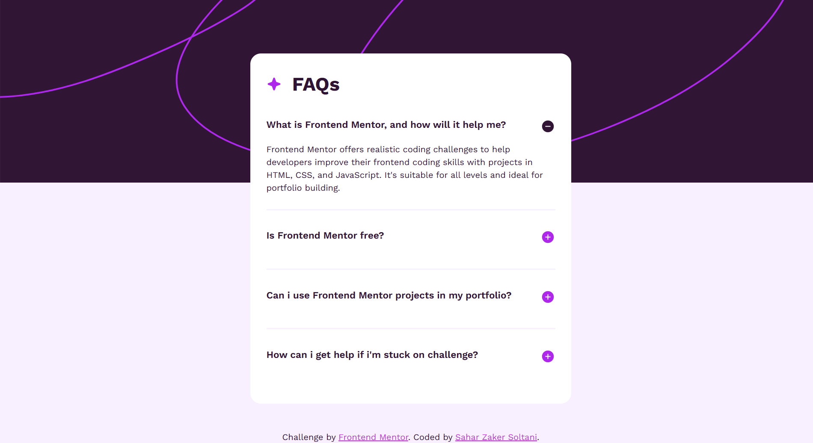

# FAQ - Accordion - Main

This project is a solution to the FAQ Accordion challenge from Frontend Mentor. The goal was to create an accessible and responsive accordion component that displays and hides answers when questions are clicked

[Live Demo](https://faq-zakersoltani.netlify.app/)

---

## Screenshots

---

## Contact

If you have any questions, feedback, or just want to connect, feel free to reach out:

- **GitHub:** [@saharzakersoltani](https://github.com/saharzakersoltani)
- **Email:** sahar.zs2002@gmail.com
- **LinkedIn:** [Sahar Zaker Soltani](https://www.linkedin.com/in/sahar-zaker-soltani)
